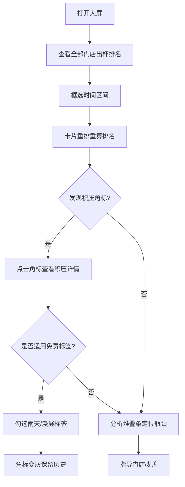

## 1. 产品概述

上海静安寺商圈督导值班室浏览器大屏，用于横向对比督导管辖的 6 品牌 12 家门店在 30 分钟窗口内的出杯数、客单价、等单时长中位数排名，并以堆叠条可视化等单/制作/取餐三阶段耗时占比，帮助督导快速识别瓶颈环节（等茶慢 vs 点单链路卡壳），并在后厨积压时自动预警。

- 目标用户：静安寺商圈督导值班人员
- 核心价值：从日汇总 GMV 颗粒度细化到 30 分钟窗口，实时定位出杯瓶颈与后厨积压，减少高峰期客诉

## 2. 核心功能

### 2.1 用户角色

| 角色 | 权限说明 |
|------|----------|
| 督导 | 查看所辖全部门店实时数据、勾选免责标签、点击角标查看积压明细 |

### 2.2 功能模块

1. **督导大屏页**：顶部筛选器、主区域排名卡片、底部时间轴、角标预警与免责标签

### 2.3 页面详情

| 页面名称 | 模块名称 | 功能描述 |
|----------|----------|----------|
| 督导大屏页 | 品牌与门店多选器 | 多选品牌 checkbox + 门店 checkbox，选中后主区域仅展示勾选门店 |
| 督导大屏页 | 日期选择器 | 选择日期，加载该日 10:00-22:00 的模拟数据 |
| 督导大屏页 | 出杯数排名卡片列 | 十二列卡片按出杯数降序排列，显示排名、店名、出杯数、客单价、等单时长中位数 |
| 督导大屏页 | 三阶段堆叠条 | 每列卡片三根堆叠条：等单（蓝）、制作（橙）、取餐（绿），hover 显示具体秒数与样本量 |
| 督导大屏页 | 底部时间轴 | 10:00-22:00 时间轴，可框选 2 小时区间，框选后上方卡片仅统计该区间数据并重算排名 |
| 督导大屏页 | 后厨积压角标 | 制作等待连续三个采样点超过同品牌其他店均值 50%，卡片右上角出现红色角标 |
| 督导大屏页 | 积压详情弹窗 | 点击角标展开该时段未完成取餐号列表（Mock 数据） |
| 督导大屏页 | 免责标签 | 勾选雨天/周边漫展标签后角标变灰但不删历史记录 |

## 3. 核心流程

督导打开大屏 → 查看默认全部门店出杯排名 → 框选晚高峰 2 小时区间 → 卡片重排，发现某店等单时长突出 → 检查堆叠条发现制作阶段占比过高 → 观察到后厨积压角标 → 点击角标查看未取餐号 → 勾选雨天免责标签 → 角标变灰

## 4. 用户界面设计

### 4.1 设计风格

- **主题**：深色工业风大屏（深蓝灰底 + 霓虹色点缀），契合值班室监控场景
- **主色**：#0B1426（深蓝灰背景）
- **辅助色**：#1B2B44（卡片背景）
- **强调色**：#00E5A0（霓虹绿-出杯数）、#FF6B35（警示橙-积压）、#3B9EFF（等单蓝）、#FFB800（制作橙）、#00D68F（取餐绿）
- **字体**：JetBrains Mono（数字/数据）+ Noto Sans SC（中文）
- **布局**：顶部控制栏 + 中部 12 列卡片网格 + 底部时间轴，桌面优先
- **圆角**：8px 卡片圆角，4px 按钮圆角
- **动画**：卡片排序过渡动画、堆叠条加载动画、角标闪烁脉冲

### 4.2 页面设计概览

| 页面名称 | 模块名称 | UI 元素 |
|----------|----------|---------|
| 督导大屏页 | 顶部控制栏 | 品牌 checkbox 组（星巴克/瑞幸/Manner/喜茶/奈雪/蜜雪）、门店 checkbox 组、日期选择器、免责标签开关 |
| 督导大屏页 | 排名卡片区 | 12 列等宽卡片网格，每卡含品牌色带、排名徽章、店名、出杯数、客单价、等单中位数、三根水平堆叠条 |
| 督导大屏页 | 堆叠条 | 三段水平条：等单(蓝)→制作(橙)→取餐(绿)，宽度按占比分配，hover tooltip 显示秒数+样本量 |
| 督导大屏页 | 后厨积压角标 | 卡片右上角红色脉冲圆点，含数字提示连续采样点数 |
| 督导大屏页 | 积压详情弹窗 | 深色模态框，列表展示未完成取餐号、等待时长 |
| 督导大屏页 | 底部时间轴 | 水平时间轴 10:00-22:00，2 小时可拖拽框选区间，每 30 分钟一个刻度 |
| 督导大屏页 | 免责标签 | 顶部开关式标签：🌧️雨天 / 🎌漫展，开启后角标变灰 |

### 4.3 响应式

- 桌面优先设计，目标分辨率 1920×1080 大屏
- 最小支持 1366×768 笔记本屏幕
- 不做移动端适配（值班室专用大屏）

### 4.4 3D 场景指引

不适用
