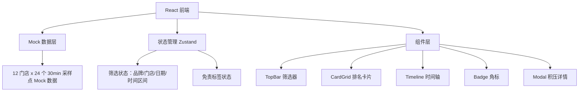
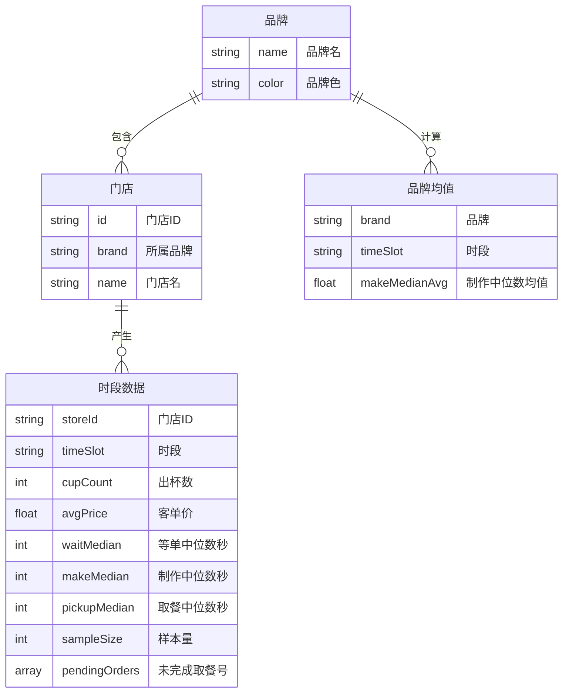

## 1. 架构设计



## 2. 技术说明

- 前端：React@18 + TypeScript + Tailwind CSS@3 + Vite
- 初始化工具：Vite (react-ts template)
- 后端：无，全部使用 Mock 数据
- 数据库：无，前端内存 Mock
- 状态管理：Zustand（轻量级全局状态）
- 图表：纯 CSS + SVG 实现堆叠条（不引入图表库，保持轻量）
- 动画：CSS transitions + keyframes

## 3. 路由定义

| 路由 | 用途 |
|------|------|
| / | 督导大屏主页（唯一页面） |

## 4. API 定义

无后端 API，全部 Mock 数据。Mock 数据结构定义：

```typescript
interface Store {
  id: string;
  brand: Brand;
  name: string;
}

type Brand = '星巴克' | '瑞幸' | 'Manner' | '喜茶' | '奈雪' | '蜜雪冰城';

interface TimeSlotData {
  storeId: string;
  timeSlot: string; // "10:00", "10:30", ..., "21:30"
  cupCount: number;
  avgPrice: number;
  waitMedian: number; // 等单中位数（秒）
  makeMedian: number; // 制作中位数（秒）
  pickupMedian: number; // 取餐中位数（秒）
  sampleSize: number;
  pendingOrders: string[]; // 未完成取餐号 Mock
}

interface BrandAvg {
  brand: Brand;
  timeSlot: string;
  makeMedianAvg: number;
}
```

## 5. 服务器架构图

无后端服务器

## 6. 数据模型

### 6.1 数据模型定义



### 6.2 数据定义语言

前端 Mock 数据生成逻辑：

- 6 品牌 × 2 门店 = 12 门店
- 每门店 24 个时段（10:00-22:00，每 30 分钟一个）
- 出杯数：按品牌特征随机生成（瑞幸高杯量低客单、星巴克低杯量高客单等）
- 客单价：瑞幸 15-25、蜜雪 8-15、星巴克 35-50、喜茶 25-35、奈雪 25-35、Manner 15-25
- 等单/制作/取餐时长：按品牌特征与时段（晚高峰更长）随机生成
- 积压判定：制作时长连续 3 个采样点超过同品牌其他店均值 50% 则标记
