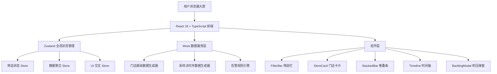
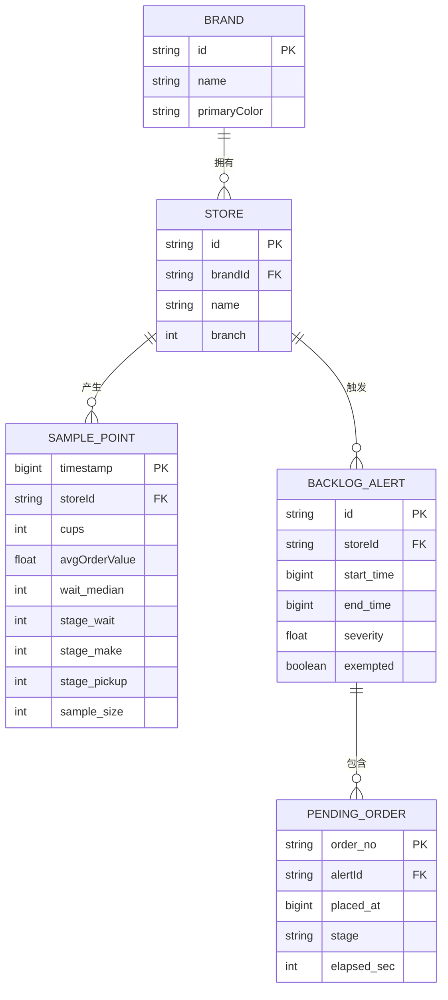

## 1. 架构设计



## 2. 技术说明

- **前端**：React@18 + TypeScript + Vite + TailwindCSS@3 + Zustand@4 + lucide-react
- **初始化工具**：vite-init (react-ts 模板)
- **后端**：无后端，纯前端 Mock 数据层
- **数据持久化**：localStorage 存储免责标签勾选状态（可选）

## 3. 路由定义

| 路由 | 用途 |
|------|------|
| `/` | 监控大屏主页（单页应用唯一页面） |

## 4. API 定义

无后端，全部使用 Mock 数据生成函数：

```typescript
// 类型定义
interface Brand {
  id: string;
  name: '星巴克' | '瑞幸' | 'Manner' | '喜茶' | '奈雪' | '蜜雪冰城';
  primaryColor: string;
  secondaryColor: string;
}

interface Store {
  id: string;
  brandId: string;
  name: string; // e.g. "星巴克 1788广场店"
  branch: number; // 1 or 2
}

interface SamplePoint {
  timestamp: number; // 毫秒时间戳
  storeId: string;
  cups: number; // 30分钟出杯数
  avgOrderValue: number; // 客单价
  waitTime: { median: number; p95: number }; // 等单时长 中位数/秒
  stages: {
    wait: number; // 等单阶段耗时中位数/秒
    make: number; // 制作阶段耗时中位数/秒
    pickup: number; // 取餐阶段耗时中位数/秒
  };
  sampleSize: number; // 样本量（订单数）
}

interface BacklogAlert {
  id: string;
  storeId: string;
  startTime: number;
  endTime: number;
  severity: number; // 超出均值百分比
  samplePoints: number[]; // 触发告警的采样点时间戳
  pendingOrders: PendingOrder[]; // 未完成取餐号
  exempted: boolean; // 是否已被免责标签覆盖
}

interface PendingOrder {
  orderNo: string; // e.g. "A056"
  placedAt: number;
  stage: 'wait' | 'make' | 'pickup';
  elapsedSec: number;
}

// 数据服务接口
interface DataService {
  getBrands(): Brand[];
  getStores(brandIds?: string[]): Store[];
  getSamplePoints(date: string, storeIds: string[], rangeStart: number, rangeEnd: number): SamplePoint[];
  getAggregatedStats(samples: SamplePoint[]): StoreStats[];
  getBacklogAlerts(date: string, storeIds: string[]): BacklogAlert[];
}

interface StoreStats {
  storeId: string;
  rank: { cups: number; aov: number; wait: number };
  cups: number;
  avgOrderValue: number;
  waitMedian: number;
  stages: { wait: number; make: number; pickup: number };
  sampleSize: number;
  alert?: BacklogAlert;
}
```

## 5. 服务器架构图

不适用（纯前端应用）

## 6. 数据模型

### 6.1 数据模型定义



### 6.2 数据定义语言

无持久化数据库，全部为内存 Mock 数据生成
